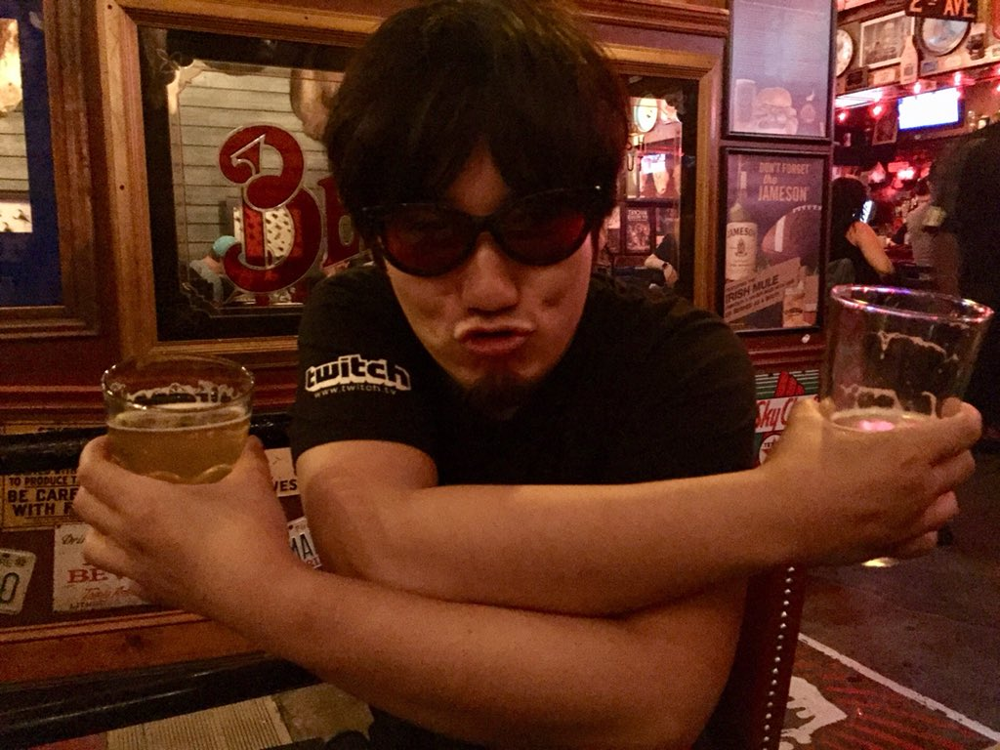

## Street-Fighter
**Compilação do melhor jogo de luta de todos os tempos.**
[The Beast](https://www.youtube.com/watch?v=JzS96auqau0&ab_channel=evo2kvids)
  

## **Street fighter Grandes Jogadores**

O japonês Daigo é, de longe, o principal nome de Street Fighter no cenário mundial. Ele pode ser considerado um pioneiro do ramo do e-sports pelo fato de aspirar a uma carreira em um período no qual o cenário competitivo ainda dava seus passos iniciais, durante a década de 1990.

Incansável, o cara escolheu Street Fighter como um modo de vida. Treinando três vezes mais que qualquer pessoa, ele passava os dias em arcades praticando suas técnicas.

Aqui estão alguns feitos deste grande jogador: 

## **Official Evo Moment #37, Daigo vs Justin Evo 2004 in HD** 

## **CYG BST Daigo (Guile) vs MOUZ Problem-X (M. Bison) - NCR 2019 - Top 16 - CPT 2019** 
 vs MOUZ Problem-X (M. Bison) - NCR 2019 - Top 16 - CPT 2019")

*``Daigo``* é um dos pro-players mais famosos da cena de jogos de luta, que ganhou fama com o famoso “Evo Moment 37”. A luta aconteceu na semifinal do torneio, entre ele e Justin Wong: com um round vencido para cada lutador, Daigo se viu em situação complicadíssima, tendo apenas um pixel de vida. Wong tentou encerrar a luta com um especial, e foi quando a mágica aconteceu. Daigo deu "parry" - uma defesa com timing perfeito - em todos os chutes de Chun Li, e finalizou o duelo logo em seguida usando o especial de seu Ken.

Infelizmente para Daigo, a mágica acabou e ele foi derrotado na grande final para Kenji "KO" Obata. Ainda assim, seu lance é lembrado até hoje como um dos mais importantes no cenário competitivo dos games. 

