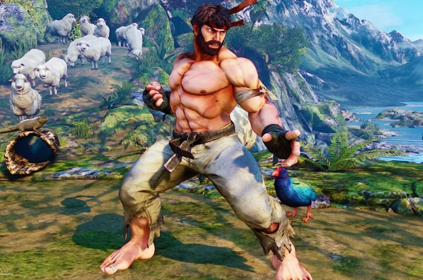

## Street-Fighter
**Compilação do melhor jogo de luta de todos os tempos.**
[The Beast](https://www.youtube.com/watch?v=JzS96auqau0&ab_channel=evo2kvids)
  

## **Street fighter Great Players**

O japonês Daigo é, de longe, o principal nome de Street Fighter no cenário mundial. Ele pode ser considerado um pioneiro do ramo do e-sports pelo fato de aspirar a uma carreira em um período no qual o cenário competitivo ainda dava seus passos iniciais, durante a década de 1990.

Incansável, o cara escolheu Street Fighter como um modo de vida. Treinando três vezes mais que qualquer pessoa, ele passava os dias em arcades praticando suas técnicas.

Aqui estão alguns feitos deste grande jogador: 

